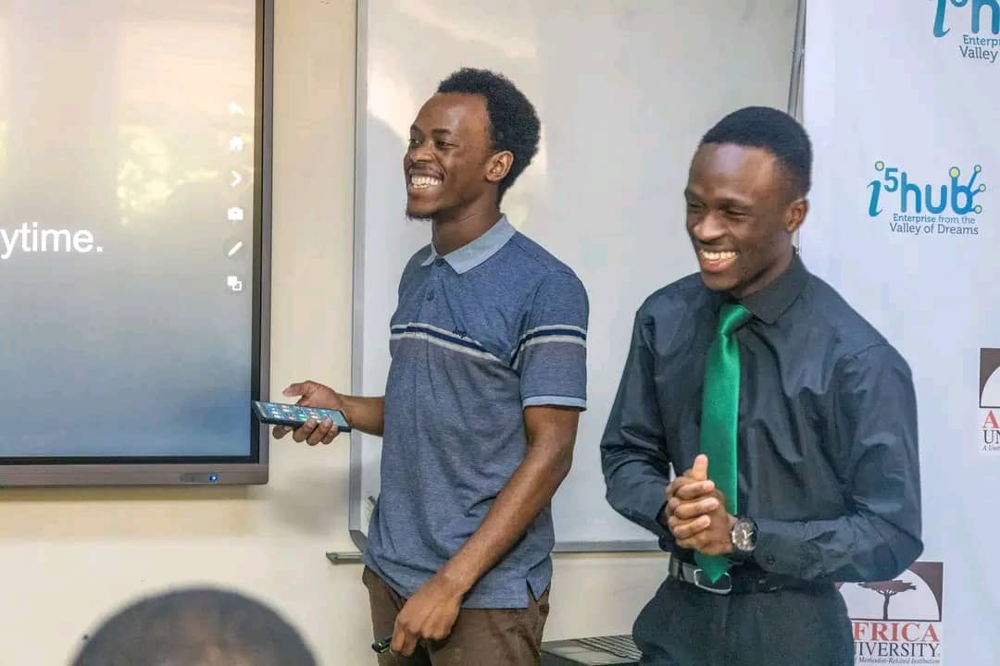
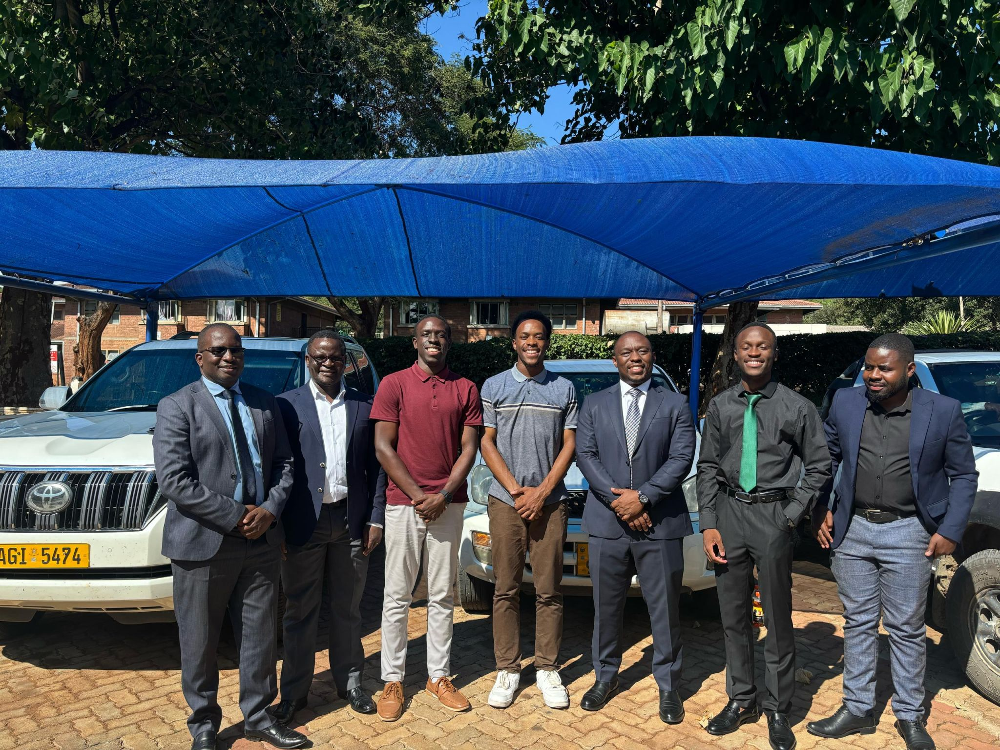
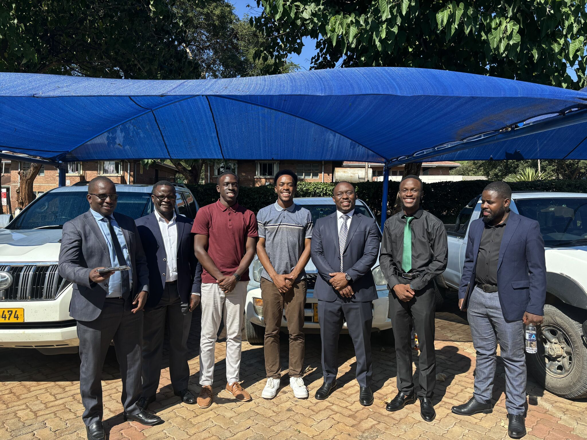

# Reflecting on Two Hackathons: AgriLease & Nexpay – One Journey, Two Stories

What a whirlwind the past few weeks have been. It still feels surreal that I led not just one—but two—hackathon teams back-to-back, juggling team coordination, pitching, live demos, bug fixes, and even some upcoming tests in between. Here’s a behind-the-scenes look into my journey as team lead for **AgriLease** and **Nexpay**, two very different projects that challenged me in unexpected ways.

---

## One Form, Two Hackathons?

It all started when the hackathon registration forms came out around the same time. My team and I initially thought it was one hackathon with multiple themes. So, I quickly registered for the **AgriHack Climate Hackathon** and came up with an idea that had been on my mind for some time—an on-demand **farm equipment rental platform**.

We called it **AgriLease**. The goal was simple: to help smallholder farmers access machinery like tractors, plows, and harvesters _without_ needing to own them. Farmers could book equipment via mobile app, **USSD**, or even **WhatsApp**. This would bring mechanization to their fingertips—especially in rural areas where it’s needed most.

I was just about to write a proposal to send to my friends and ask them to join the team when my friend Tapiwa asked me:

> _"Did you register for the Fintech Hackathon too?"_

I blinked. _Wait—there's another one?_

---

## Surprise Fintech Hackathon – Nexpay Was Born

Turns out there were **two** separate hackathons. I had missed the Fintech Hackathon’s deadline by a day, but by some stroke of luck, our late registration was accepted. That’s when **Nexpay** came to life.

The theme? **Digital financial solutions**.  
The prize? Real money — **$1000**, **$500**, and **$300** for the top 3.

Me, **Tapiwa**, and **Tino** formed the team. None of us had ever built a mobile app before. We were ReactJS folks—web development was our zone. But this time, we jumped headfirst into **React Native**, eager to learn and determined to deliver.

And let me tell you… it wasn’t smooth.

---

## Sleepless Nights, Bugs & Breakthroughs

We coded for hours. Days blurred into nights, and our biggest enemy wasn’t just sleep—it was **bugs**.

One night, our **QR code feature** worked great… until we tried to encrypt it. Suddenly, the scanner just gave up. I remember Tapiwa waking me up the next morning, saying:

> “Courtney, it’s not working anymore…”

**Panic mode.**

We were just about to pitch—**at 9 AM**—and everything was falling apart. We pleaded with the MC to let us go last so we could troubleshoot. Thanks to **Git**, we reverted the changes and restored the working version with **NFC and QR functionality** intact.

That live demo was everything to us. Our hands were shaking during the pitch. We had no clue whether we nailed it or not.

But then…

We were announced as **the winners**. 🥇  
We literally screamed, laughed, celebrated, and then slept like babies.

📌 <a href="https://www.linkedin.com/posts/tapiwa-mukoyi_im-excited-to-share-that-my-team-and-i-took-activity-7315124359650521089-Dycz?utm_source=share&utm_medium=member_desktop&rcm=ACoAAFWD_bgBhLOMDt_HPgyLWj3TJVaSUGkFM9w">Tapiwa's LinkedIn post</a>
📌<a href="https://www.linkedin.com/posts/tinotenda-mukuhwa-b198522b0_it-brings-me-great-pleasure-to-announce-that-activity-7315684573042868224-gBpA?utm_source=share&utm_medium=member_desktop&rcm=ACoAAFWD_bgBhLOMDt_HPgyLWj3TJVaSUGkFM9w">Tino's LinkedIn Post</a>  
📌 <a href="https://www.linkedin.com/posts/africa-university_i5-hub-leads-innovation-impact-inclusion-activity-7314583569157316608-Dok-?utm_source=share&utm_medium=member_desktop&rcm=ACoAAFWD_bgBhLOMDt_HPgyLWj3TJVaSUGkFM9w">The School's official post</a>

---

## Meanwhile, in AgriHack Land…

While Nexpay was all about code, **AgriLease** was more about the **vision**.  
Because there was no prize money for AgriHack, we prioritized Nexpay first.

For AgriLease, we focused on a strong **pitch deck**. We built no MVP, no prototype—just a well-polished idea with realistic impact. My team for this one grew to five members: myself, **Tapiwa**, **Tino**, **Leopold**, and **Tanaka**.

Despite juggling both hackathons simultaneously, we still managed to bag **3rd place** with AgriLease. That felt like a win in itself.

📌<a href="https://www.linkedin.com/posts/tanaka-gombarume-536b66183_entrepreneurship-business-fintech-activity-7315027735163092994-uP4p?utm_source=share&utm_medium=member_desktop&rcm=ACoAAFWD_bgBhLOMDt_HPgyLWj3TJVaSUGkFM9w">Tanaka's Post</a>

---

## Lessons, Growth & Gratitude

Leading two teams back-to-back stretched every skill I had—from time management to communication, from design thinking to debugging under pressure.

There were moments I reached out to ChatGPT asking about how to make NFC work properly in React Native or how to set up the QR encryption. Those little bug-fixing sessions at 1 AM turned into moments of real growth.

What I’m most proud of, though, is not just the wins—but the journey itself. The people. The grind. The late-night laughter. The final-minute fixes. The way we showed up for each other.

To my teammates—**Tino**, **Tapiwa**, **Leopold**, and **Tanaka**—thank you for trusting me to lead. We did this together.

---

## Pictures

Hover or tap on the pictures below to bring a photo to the front.

  
  
  
  
  
  

---

## Final Thoughts

This hackathon experience was a reminder that with the right team, clear vision, and an eagerness to learn, you can build anything. Whether it's winning a Fintech competition or designing a platform for farmers, every line of code counted.

More than anything, this is only the beginning.

> 🧠 _Stay curious. Build often. Reflect always._

Until next time,  
**Courtney Fradreck**

---
