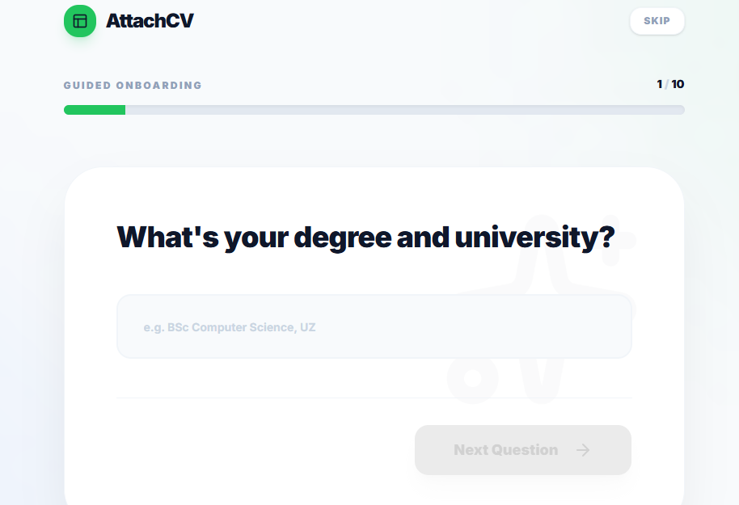
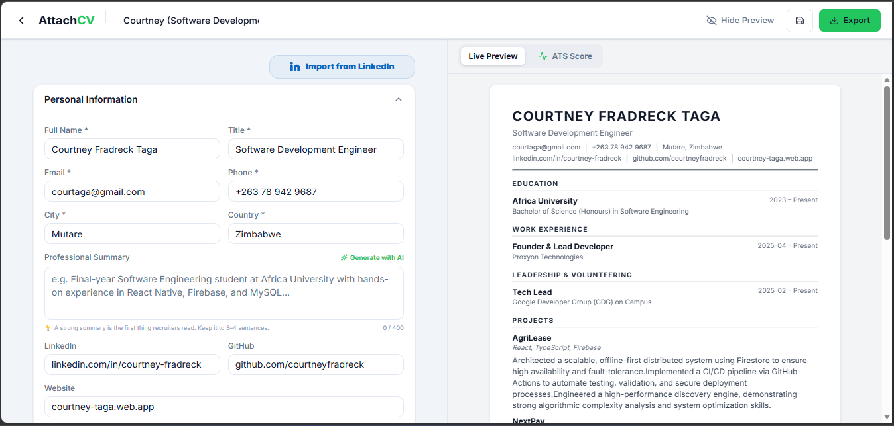
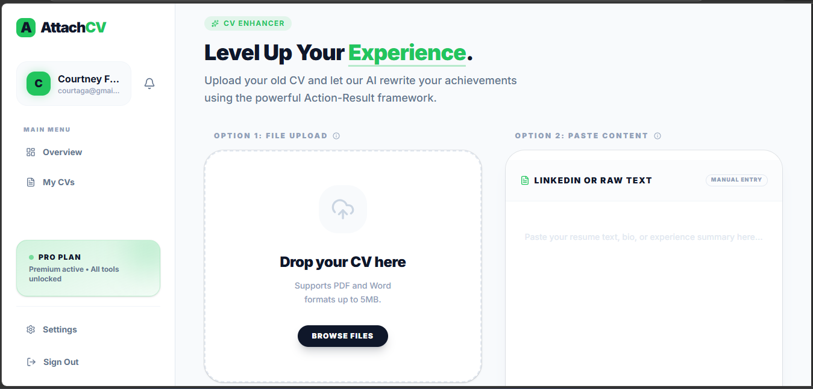
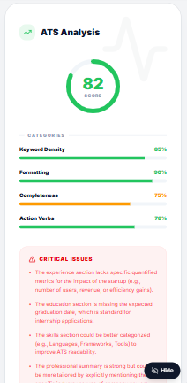
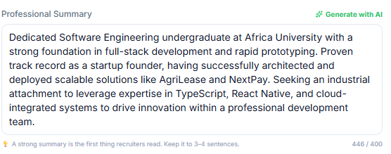
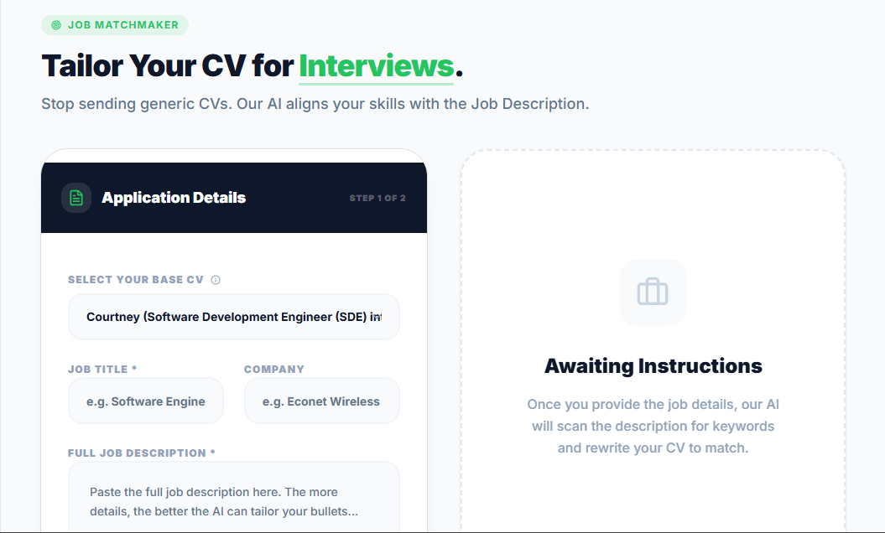
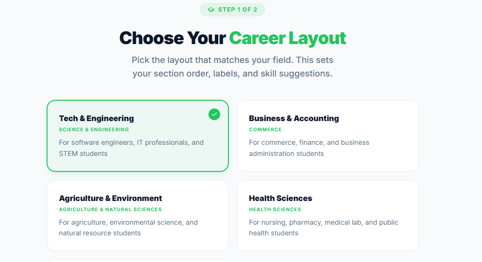

There's a question many students quietly ask themselves during application season:

**Ever wonder why your CV gets rejected before you even get an interview?**

You apply. You meet the requirements. You've done the coursework. You've worked on projects.

Yet somehow, you never hear back.

That is the problem AttachCV was built to solve.

## What is AttachCV?

AttachCV is an AI-powered CV optimization platform designed specifically for
university students and early-career professionals preparing for industrial
attachment, internships, and entry-level roles.

It helps you transform your academic experience into a professional,
ATS-optimized CV that is designed to get you one step further —
**the interview stage**.

AttachCV is not just a CV builder.

It is a **digital career architect** that helps you understand, improve, and
position your CV for real hiring systems.

## Why AttachCV Exists

Many students fail to secure attachments not because they lack ability, but
because their CVs fail to communicate their value.

AttachCV exists to ensure that students:

- Present their academic work effectively
- Pass Applicant Tracking Systems (ATS)
- Compete confidently in modern hiring pipelines

The goal is simple: **to help you reach the interview stage.**

## The Problem

### The Experience Paradox

Students often believe they have "nothing to include" on their CV because they
lack formal work experience. In reality, they already have valuable content —
coursework, academic projects, leadership roles, and technical assignments —
but they don't know how to present it.

### The ATS Barrier

Most companies now use Applicant Tracking Systems (ATS) to filter applications
before a human ever sees them. If your CV is not properly structured or lacks
the right keywords, it gets rejected automatically.

### The Canva Trap

Many students use visually appealing CV templates from design tools. While
these look good, they often break ATS parsing systems, causing qualified
candidates to be filtered out before anyone reads a single word.

### Fragmented Career Guidance

Advice from lecturers, peers, and the internet is often inconsistent, leading
to generic CVs that fail to stand out.

### The Localization Barrier

Many global CV platforms require international payments, making them
inaccessible or inconvenient for students in Zimbabwe and similar markets.

## The Solution

AttachCV acts as a digital career consultant that helps you both diagnose and
improve your CV. Instead of guessing what works, the platform gives you
structured tools and AI-powered feedback to improve your chances of getting
shortlisted.

## Current Features

### 1. Experience Discovery — AI Onboarding Interview

Before you build a single section, AttachCV asks you the right questions.

The onboarding flow guides you through a structured 10-question interview
designed to surface experiences you may have overlooked — academic projects,
campus leadership, technical coursework, volunteer work, and more.

By the end, AttachCV has enough context to help you build a compelling CV
even if you've never held a formal job.

<figure class="main-article__figure">
  
  <figcaption>Experience Discovery onboarding interview</figcaption>
</figure>

### 2. ATS-Friendly CV Builder

Create clean, structured CVs using templates engineered to pass ATS filters
and present your information clearly to recruiters.

Every template is single-column, keyword-friendly, and formatted for parsing
— the opposite of the Canva trap.

<figure class="main-article__figure">
  
  <figcaption>ATS-friendly CV builder</figcaption>
</figure>

### 3. CV Upload and Conversion

Already have a CV? Upload it and AttachCV automatically converts it into an
ATS-optimized format without you having to rebuild it from scratch.

Supports both PDF and Word documents.

<figure class="main-article__figure">
  
  <figcaption>CV upload and conversion</figcaption>
</figure>

### 4. Manual CV Editing

Full control over every section of your CV through a structured editor. Edit,
rearrange, and refine your content at any point in the process.

### 5. ATS Score and Full Diagnostic

Get instant feedback on how your CV performs against ATS systems.

**Free tier** users receive an overall ATS score so they know where they stand.

**Premium users** get the full diagnostic breakdown:

- Keyword match analysis against industry and role-specific terms
- Formatting and structure assessment
- Section-by-section improvement recommendations
- Specific gaps identified with suggestions to address them

This turns a vague rejection into actionable insight.

<figure class="main-article__figure">
  
  <figcaption>ATS score and diagnostics</figcaption>
</figure>

### 6. AI Bullet-Point Optimizer

Weak bullet points are one of the most common CV problems. Phrases like
"worked on projects" or "assisted with tasks" communicate almost nothing to a
recruiter or ATS system.

The bullet optimizer takes your existing points and rewrites them using strong
action verbs, quantifiable outcomes, and professional framing — turning
passive descriptions into evidence of real capability.

### 7. AI Profile Summary Generator

Your profile summary is the first thing a recruiter reads. It needs to be
sharp, specific, and tailored — not a copy-paste from someone else's CV.

AttachCV generates a personalized profile summary based on your actual
experience, skills, and target role, giving you a strong opening that sets
the right tone for the rest of your CV.

<figure class="main-article__figure">
  
  <figcaption>AI profile summary generator</figcaption>
</figure>

### 8. Matchmaker — Job Description Tailoring

One of the most effective ways to pass ATS screening is to tailor your CV to
the specific job you are applying for.

Matchmaker lets you paste in a job description and instantly:

- Identifies keywords and requirements in the JD
- Highlights gaps in your current CV
- Suggests targeted improvements to increase your match score
- Shows your compatibility percentage with that specific role

Instead of sending the same CV everywhere, you submit one that speaks
directly to each opportunity.

<figure class="main-article__figure">
  
  <figcaption>Matchmaker job tailoring</figcaption>
</figure>

### 9. CV Export

Download your CV in a clean, professional format — ready for submission,
every time.

Free tier users pay a flat $1.50 per export. Premium users download
without limits for the duration of their plan.

### 10. Multiple CV Versions

Different roles call for different CVs. Premium users can save and manage
multiple CV versions within the platform — one tailored for software roles,
another for IT support, another for research positions — without losing
previous work.

<figure class="main-article__figure">
  
  <figcaption>Multiple CV versions management</figcaption>
</figure>

### 11. Localized Payments

AttachCV accepts EcoCash, OneMoney, and card payments — no Visa or Mastercard
required to unlock premium features. Payments process in under 30 seconds.

Plans are prepaid with no auto-renewal. You are always in control.

## What Makes AttachCV Different?

AttachCV is built around **performance, not just design**.

Unlike traditional CV tools, it focuses on:

- Passing ATS systems, not just looking good
- Translating academic experience into professional value
- Providing specific, actionable feedback
- Supporting students within the local context — Zimbabwe's universities,
  roles, and payment systems

It is designed specifically for students preparing for attachment — not
generic job seekers.

## Pricing

AttachCV uses a localized freemium model to ensure accessibility.

### Free Tier — Attachment Starter

- ATS-friendly CV builder
- CV upload and conversion
- Manual editing
- Up to 1 CV generation per day
- ATS score (no detailed breakdown)
- $1.50 per export

Any student can start improving their CV immediately at no upfront cost.

### Standard Plan — $2.99 for 30 days

- Full ATS diagnostic breakdown
- Keyword and formatting analysis
- AI bullet-point optimizer
- AI profile summary generator
- Matchmaker — job description tailoring
- Up to 10 saved CVs
- 3 CV templates
- Unlimited exports

### Advanced Plan — $7.99 for 30 days

Everything in Standard, plus:

- AI cover letter generation
- Job matching and opportunity suggestions
- Skill gap analysis
- LinkedIn Profile Generator
- All 5 CV templates
- Priority support

No auto-renewal on either plan. Pay when you need it.

## What's Coming Next

AttachCV will continue evolving with features such as:

- Interview preparation tools
- RecruitFeed — employer access to vetted, attachment-ready candidates
- Institutional dashboards for university career offices

## Final Thoughts

AttachCV was built to answer one critical question:

**Is your CV strong enough to get you an interview?**

By identifying weaknesses and guiding improvements, the platform helps turn
uncertain applicants into confident, interview-ready candidates.

If you are preparing for attachment, your CV is your first opportunity.

AttachCV helps you make it count.

---

\*In the next post: **How AttachCV Works — A Step-by-Step Walkthrough.\***
_From uploading your CV to walking out interview-ready._
